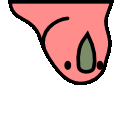
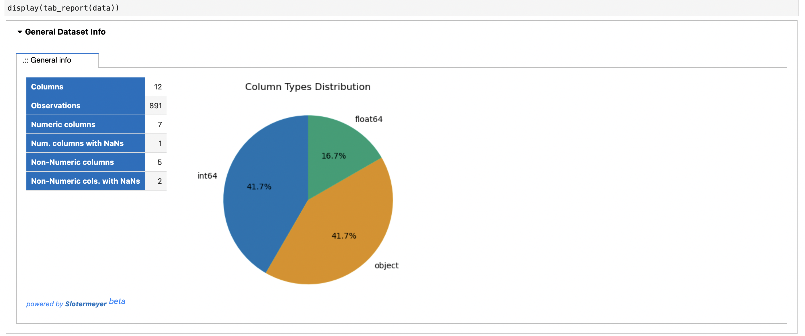
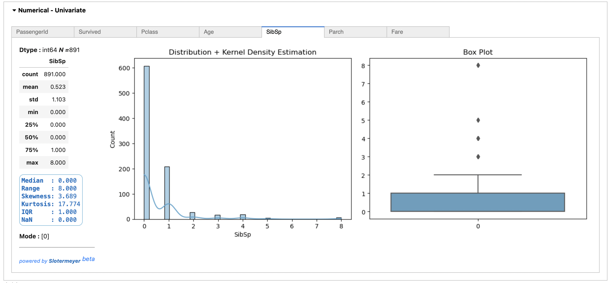
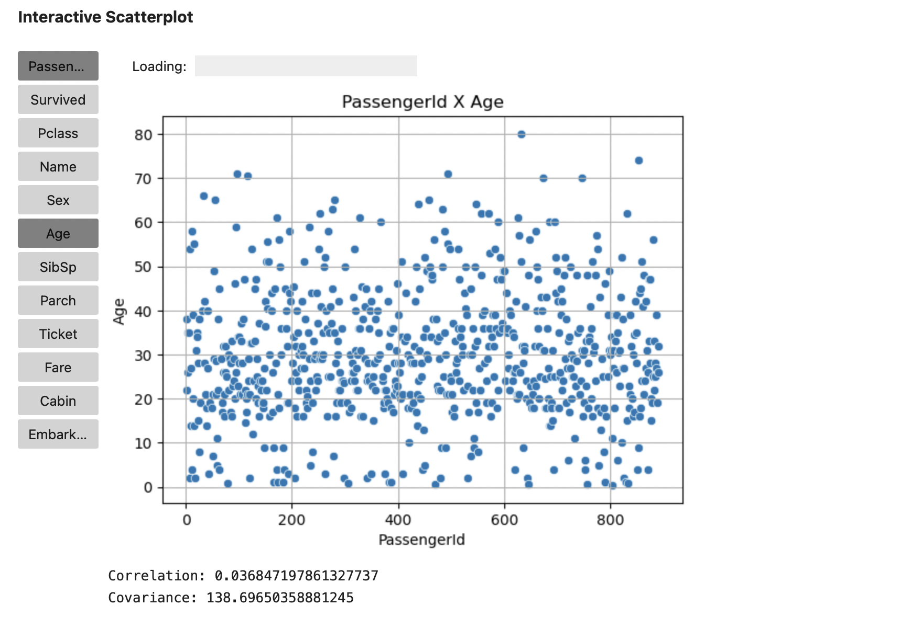

# Hi there, Fabio here 

> I am an A.I. post-graduation student and an experienced system analyst for the financial sector (experience in banks and exchanges) by designing solutions, developing programs as Sr Cobol code, and leading a multi-skilled team as a tech lead.

> Now  I am pursuing a career change to the A.I. world, programming in python and eating books about statistics and mathematicss ( =s ).

> I am also starting a youtube channel to share my discoveries in data science as well as a blog/medium to share knowledge called sigma squared.

> You can reach me by mail at fabiojr@skiff.com or sigmasquared@skiff.com

<h2> It is my humble repository. I  hope you can find something useful.</h2>

<h3> I am currently working on the following projects:</h3>

| Project | Description | Status |
|------|-------|-------|
| [Kitai Hakai](https://github.com/FabioD-Junior/Kitai)  | A simple chat-bot for telegram, light and customizable | -[x] beta version available
| [COVID-19 Detection](https://github.com/FabioD-Junior/Covid-19-CNN)  | Detects COVID-19 in lung X-rays using Convolutional Neural Networks. This is an improved version of parts of a college group project I participated in. I extracted the parts I worked on and reworked the code to optimize it and focus on detection via CNN. | -[x] Jupyter Notebook finished
| Slotermeyer  | Python Lib for speeding up EDA process. For Kagglers analyzing data through EDA and descriptive analysis in the Jupyter environment.    |-[x] Alpha Private Version |
| SigmaSquared | A repository for keeping the source codes from my channel project to share knowledge about A.I. through videos and articles. | -[ ] In progress|

### Sample of the current state of Slotermeyer Lib :
From a pandas dataframe you can, with a simple command, generate a report on your data organized into sessions and tabs.
Summary, Numerical data, and Categorical data, proving information and graphs using descriptive analysis techniques.
Theses and many more functions for univariate and multivariate analysis, time-series analysis, and much more.

This way, the user can have information about their data with just a few lines of code, organized in a cleaner way within the Jupyter notebook.
Instead of having to scroll through pages and pages, the user uses tabs and sections that are organized by features.

#### Summary of the dataset (using Kaggle Titanic dataset for testing)

#### Describing numerical features using Univariate analysis:

#### Prototype of an interactive Scatterplot:

# Thank you for visiting and don't forget to party with parrots!

 >  Find more party parrots [here](https://cultofthepartyparrot.com/), all the birds here are from there. =]  
<!--
**FabioD-Junior/FabioD-Junior** is a ✨ _special_ ✨ repository because its `README.md` (this file) appears on your GitHub profile.

Here are some ideas to get you started:

- 🔭 I’m currently working on ...
- 🌱 I’m currently learning ...
- 👯 I’m looking to collaborate on ...
- 🤔 I’m looking for help with ...
- 💬 Ask me about ...
- 📫 How to reach me: ...
- 😄 Pronouns: ...
- ⚡ Fun fact: ...
-->
